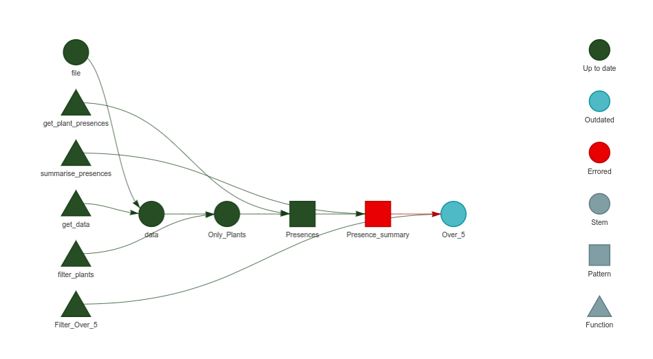

# Issue with Combining and Naming Branches in targets R Package

All the code and datasets are avalable at this [github repo]()

I am currently working on a workflow for Species Distribution Modeling using the targets R package. I've encountered two issues in a specific part of my workflow. Firstly, I am downloading presences in parallel using the crew package since the actual dataset consists of around 40,000 species. I have provided the relevant code below:

```{r, include=FALSE}
library(targets)
library(ggplot2)
library(data.table)
```


```{r, eval=FALSE}
library(targets)
source("R/functions.R")
library(crew)

tar_option_set(packages = c("readr", "SDMWorkflows", "janitor", "data.table"),
               controller = crew_controller_local(workers = 6),
               error = "null")
list(
  tar_target(file, "First_10_species.csv", format = "file"),
# Read the file
  tar_target(data, get_data(file)),
# Filter the species to only plants
  tar_target(Only_Plants, filter_plants(data)),
# Parallelize and retrieve species presences for species within Denmark
  tar_target(Presences,
             get_plant_presences(Only_Plants),
             pattern = map(Only_Plants)),
# summarize the number of presences per species
  tar_target(Presence_summary, summarise_presences(Presences),
             pattern = map(Presences)),
# Filter to only the species that have 5 presences
  tar_target(Over_5, Filter_Over_5(Presence_summary))
)
```

The SDMWorkflows package is a package I made that you can install by using this code

```{r, eval = F}
remotes::install_github("Sustainscapes/SDMWorkflows")
```


The accompanying function script (R/functions.R) is as follows:


```{r}
get_data <- function(file) {
  readr::read_csv(file) |>
    janitor::clean_names() 
}

filter_plants <- function(df){
  result <- df |>
    dplyr::filter(kingdom == "Plantae") |>
    dplyr::pull(species) |>
    unique() |>
    head(10)
  return(result)
}

get_plant_presences <- function(species){
  SDMWorkflows::GetOccs(Species = unique(species),
                        WriteFile = FALSE,
                        Log = FALSE,
                        country = "DK",
                        limit = 100000,
                        year='1999,2023')
}

summarise_presences <- function(df){
  Sum <- as.data.table(df)[, .N, keyby = .(family, genus, species)]
  return(Sum)
}

Filter_Over_5 <- function(DT){
  DT[N > 5]
}
```


While the workflow appears to be working well, some species summaries are showing errors. The errors are documented in the following table and figure

```{r, echo = F}
structure(list(name = c("Presence_summary_24c8afe2", "Presence_summary_7044ad96", 
                        "Presence_summary_a8f163ad", "Presence_summary_c7ecffc9"), error = c("object genus not found", 
                                                                                             "object genus not found", "object genus not found", "object genus not found"
                        )), row.names = c(NA, -4L), class = c("tbl_df", "tbl", "data.frame"
                        )) |> knitr::kable()
```

```{r}

```


These errors are expected for species that did not present presences within Denmark. However, the summary appears fine, and from the initial 10 presences, it generates a data.table with 6 species, as illustrated in this table:

```{r, echo = F}
knitr::kable(tar_read("Presence_summary"))
```


I have two specific questions:

* Addressing Errors in summarise_presences: Despite the errors, the results of summarise_presences are as expected. How can I eliminate these errors from the summary? 

* Filtering Species in Presences for Plotting: Suppose I want to use the results of Presences to plot coordinates with a function like PlotPres, but I only want to include species that appear in the Over_5 object. How can I achieve this mapping, considering that the species have names instead of branches?

```{r}
PlotPres <- function(df){
G <-  ggplot(df , aes(x = decimalLongitude, y = decimalLatitude)) + geom_point() + theme_bw()

print(G)
}
```

as you can see if I do this for branch 6 it works

```{r}
PlotPres(tar_read("Presences", branches = 6)[[1]])
```

