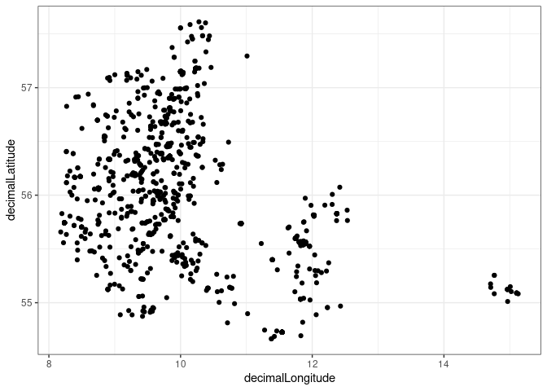

# Issue with Combining and Naming Branches in targets R Package

All the code and datasets are avalable at this [github repo]()

I am currently working on a workflow for Species Distribution Modeling
using the targets R package. I’ve encountered two issues in a specific
part of my workflow. Firstly, I am downloading presences in parallel
using the crew package since the actual dataset consists of around
40,000 species. I have provided the relevant code below:

``` r
library(targets)
source("R/functions.R")
library(crew)

tar_option_set(packages = c("readr", "SDMWorkflows", "janitor", "data.table"),
               controller = crew_controller_local(workers = 6),
               error = "null")
list(
  tar_target(file, "First_10_species.csv", format = "file"),
# Read the file
  tar_target(data, get_data(file)),
# Filter the species to only plants
  tar_target(Only_Plants, filter_plants(data)),
# Parallelize and retrieve species presences for species within Denmark
  tar_target(Presences,
             get_plant_presences(Only_Plants),
             pattern = map(Only_Plants)),
# summarize the number of presences per species
  tar_target(Presence_summary, summarise_presences(Presences),
             pattern = map(Presences)),
# Filter to only the species that have 5 presences
  tar_target(Over_5, Filter_Over_5(Presence_summary))
)
```

The SDMWorkflows package is a package I made that you can install by
using this code

``` r
remotes::install_github("Sustainscapes/SDMWorkflows")
```

The accompanying function script (R/functions.R) is as follows:

``` r
get_data <- function(file) {
  readr::read_csv(file) |>
    janitor::clean_names() 
}

filter_plants <- function(df){
  result <- df |>
    dplyr::filter(kingdom == "Plantae") |>
    dplyr::pull(species) |>
    unique() |>
    head(10)
  return(result)
}

get_plant_presences <- function(species){
  SDMWorkflows::GetOccs(Species = unique(species),
                        WriteFile = FALSE,
                        Log = FALSE,
                        country = "DK",
                        limit = 100000,
                        year='1999,2023')
}

summarise_presences <- function(df){
  Sum <- as.data.table(df)[, .N, keyby = .(family, genus, species)]
  return(Sum)
}

Filter_Over_5 <- function(DT){
  DT[N > 5]
}
```

While the workflow appears to be working well, some species summaries
are showing errors. The errors are documented in the following table and
figure

| name                      | error                  |
|:--------------------------|:-----------------------|
| Presence_summary_24c8afe2 | object genus not found |
| Presence_summary_7044ad96 | object genus not found |
| Presence_summary_a8f163ad | object genus not found |
| Presence_summary_c7ecffc9 | object genus not found |

``` r
knitr::include_graphics("PlotTarget.png")
```


These errors are expected for species that did not present presences
within Denmark. However, the summary appears fine, and from the initial
10 presences, it generates a data.table with 6 species, as illustrated
in this table:

| family      | genus       | species              |    N |
|:------------|:------------|:---------------------|-----:|
| Pinaceae    | Abies       | Abies cephalonica    |    1 |
| Pinaceae    | Abies       | Abies koreana        |    3 |
| Pinaceae    | Abies       | Abies nordmanniana   | 1130 |
| Pinaceae    | Abies       | Abies sibirica       |   14 |
| Pinaceae    | Abies       | Abies veitchii       |    2 |
| Thuidiaceae | Abietinella | Abietinella abietina |    9 |

I have two specific questions:

- Addressing Errors in summarise_presences: Despite the errors, the
  results of summarise_presences are as expected. How can I eliminate
  these errors from the summary?

- Filtering Species in Presences for Plotting: Suppose I want to use the
  results of Presences to plot coordinates with a function like
  PlotPres, but I only want to include species that appear in the Over_5
  object. How can I achieve this mapping, considering that the species
  have names instead of branches?

``` r
PlotPres <- function(df){
G <-  ggplot(df , aes(x = decimalLongitude, y = decimalLatitude)) + geom_point() + theme_bw()

print(G)
}
```

as you can see if I do this for branch 6 it works

``` r
PlotPres(tar_read("Presences", branches = 6)[[1]])
```

<!-- -->
